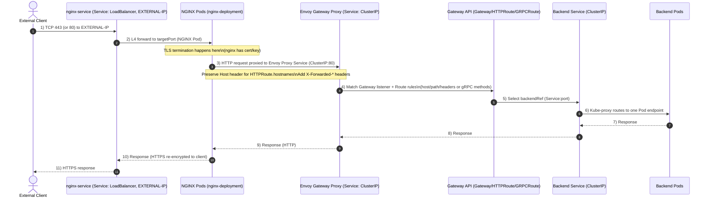

# Gabiacloud

- [로드 밸런서 사용하기](https://customer.gabia.com/manual/cloud/23381/24281)
- [nginx.yml](./nginx.yml)

`nginx.service`는 `clusterIp`로 기본적으로 노출되는 것이 아니라, `NodePort`로 control-plane에 노출됨.

## TODO

- [ ] gabiacloud TLS 인증서를 어떻게 연결하는지

