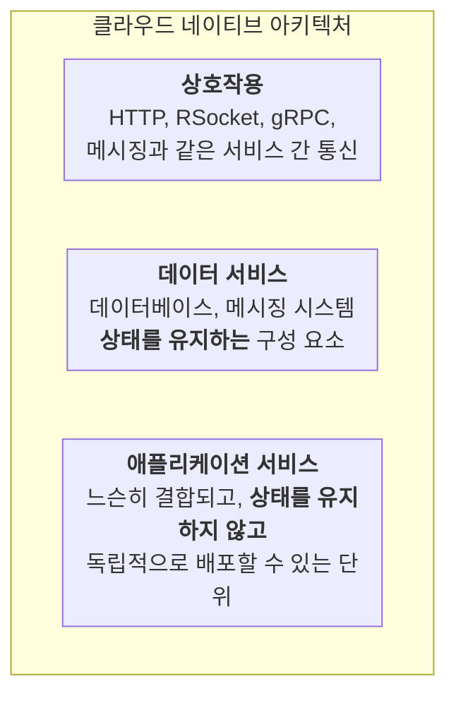

<!-- TOC -->
* [클라우드 네이티브 (Cloud Native)](#클라우드-네이티브-cloud-native)
  * [CI (Continuous Integration)](#ci-continuous-integration)
  * [CD (Continuous Delivery)](#cd-continuous-delivery)
  * [컨테이너](#컨테이너)
  * [서버리스](#서버리스)
  * [15요소 방법론 (15 Factor methodology)](#15요소-방법론-15-factor-methodology)
    * [1. 하나의 코드베이스 하나의 애플리케이션](#1-하나의-코드베이스-하나의-애플리케이션)
    * [2. API 우선](#2-api-우선)
    * [3. 로그](#3-로그)
    * [4. 일회성](#4-일회성)
    * [5. 관리 프로세스(Administrative process)](#5-관리-프로세스administrative-process)
    * [6. 상태를 갖지 않는 프로세스(stateless process)](#6-상태를-갖지-않는-프로세스stateless-process)
    * [7. 원격 측정](#7-원격-측정)
    * [8. 인증 및 승인](#8-인증-및-승인)
<!-- TOC -->

# 클라우드 네이티브 (Cloud Native)

개발자와 운영자 간의 협력이 가장 중요하다.

모두 함계 전체 제품 수명 주기에 대한 책임이 있으며 지속적 전달이라는 목표를 달성하기 위해 중요하다.

## CI (Continuous Integration)

커밋이 있으면 소스는 자동으로 컴파일되고 테스트되며
실행 가능한 아티팩트(예: Jar, 컨테이너 이미지)로 패키징된다.

새로운 변경이 있을 때마다 소트프웨어 상태에 대한 피드백을 빨리 얻고자 하는 의도다.

오류가 감지되면 즉시 수정함으로써 기본 브랜치는 개발 작업을 문제없이 계속하기 위한 안정적인 토대가 되어야 한다.

## CD (Continuous Delivery)

CI를 기반으로 하며 **기본 브랜치가 문제없이 배포 가능한 상태를 유지**하도록 하는 데 중점을 둔다.

지속적 전달은 배포 파이프라인(deployment pipeline)을 통해 전체 프로세스의 자동화를 촉진한다.

이 과정에서 **배포 유효성**을 검증하기 위해 테스트, 통합 테스트, 보안 테스트, 컴플라이언스 테스트와 같은 여러 테스트를 거친다.

지속적 전달을 지속적 배포(continuous deployment)와 혼동하는 경우가 있다.

지속적 전달은 변경이 이루어진 후에 소프트웨어가 실제 서비스 환경에 배포될 수 있는 상태인지 확인을 필요로 한다.

배포 여부는 사업상의 결정이다. 반면 지속적 배포는 배포 파이프라인에 마지막 단계를 하나 추가하여 변경된 사항을 프로덕션에 자동으로 배포한다.

## 컨테이너

컨테이너 이전에는 환경 재추축, 격리 및 설정을 위해 가상 컴퓨터에 의존함.

* **네임스페이스**(namespace): 각 프로세스가 시스템에서 사용할 수 있는 리소스를 일부만 볼 수 있도록 하기 위해 프로세스 간 리소스를 분할
* **c그룹**(cgroup): 프로세스(또는 프로세스 그룹)에 대한 리소스 사용을 제어하고 제한

동일한 배포 환경을 보장할 수 있음. (arm, amd64 와 같은 환경이 달라짐: `docker multi stage build`)

## 서버리스

서버리스 아키텍처는 일반저긍로 함수와 관련 있지만 두 가지 모델로 나뉜다.

* **서비스형 백엔드**(backend as a service, BaaS): 백엔드 서비스의 개발 및 운영 비용을 줄이는 데 중점을 둔다.
  개발자는 백엔드 기능의 대부분 또는 전부를 BaaS 공급 업체에 일임하고 FE 애플리케이션을 구현할 수 있다. 예를 들어 옥타(Okta)를 사용해 사용자를 인증하는 경우가 있다.
* **서비스형 함수**(function as a service, FaaS): 상태가 없고 이벤트에 의해 실행되며 플랫폼이 전적으로 관리하는 애플리케이션을 의미한다.
  케이네이티브 및 아파치 오픈휘스크가 있다.

```mermaid
flowchart TB
  subgraph CNA[클라우드 네이티브 아키텍처]
    direction LR

    subgraph App["`
    **애플리케이션 서비스**
    느슨히 결합되고, **상태를 유지하지 않고**
    독립적으로 배포할 수 있는 단위
    `"]
    end

    subgraph DataService["`
    **데이터 서비스**
    데이터베이스, 메시징 시스템
    **상태를 유지하는** 구성 요소
    `"]
    end

    subgraph Interaction["`
    **상호작용**
    HTTP, RSocket, gRPC,
    메시징과 같은 서비스 간 통신
    `"]
    end

  end
```

---

## 15요소 방법론 (15 Factor methodology)

클라우드 네이티브 애플리케이션을 개발하기 좋은 출발점이다.

* 하나의 코드베이스, 하나의 애플리케이션
* API 우선
* 의존성 관리 (명시적인 방식으로 선언. 예: something-util:1.1.8)
* 설계, 빌드, 릴리스, 실행 (런타임에 코드를 변경하지 못함)
* 설정(configuration), credentials (환경 변수화)
* 로그
* 일회성
* 지원 서비스(backing services): 모놀리식을 분리하여 애플리케이션 서비스 + 데이터 서비스
* 환경 동일성(environment parity): time gap, people gap(운영 환경 버전들..?), tool gap(예: postgresSQL, H2 등등)
* 관리 프로세스
* 포트 바인딩
* 상태를 갖지 않는 프로세스(stateless process)
* 동시성
* 원격 측정
* 인증 및 승인

### 1. 하나의 코드베이스 하나의 애플리케이션

모노레포를 금지하자는 것이 아니다.
"독립 빌드/배포/런타임을 지키자"를 의미한다.

### 2. API 우선

클라우드 네이티브 시스템은 API를 통해 서로 통신하는 다양한 서비스로 이루어진다.

클라우드 네이티브 애플리케이션을 설계할 때 **API 우선**(API First) 접근 방식을 사용하면 분산 시스템에
적합하도록 시스템을 고려하고 서로 다른 팀 간의 업무를 배분할 수 있다.

API를 먼저 설계함으로써 해당 애플리케이션을 백엔드 서비스로 사용하는 다른 팀은 해당 API를 가지고 자신들의
시스템 개발을 진행할 수 있다.

코드 계약을 미리 설계하면 다른 시스템과의 통합은 더욱 견고해진다. 내부적으로는 다른 애플리케이션에 영향을 미치지 않고
API의 구현을 변경할 수도 있다.

### 3. 로그

클라우드 네이티브 애플리케이션은 로그의 라우팅 및 저장과는 관련이 없다.
애플리케이션은 로그를 시간 순서대로 생성되는 이벤트로 처리해 표준 출력에 기록한다.
로그 저장이나 순환에 대해서는 애플리케이션이 더 이상 신경 쓰지 말아햐 한다.
로그 수집기와 같은 외부 툴을 사용해 로그를 수집하고 검사할 수 있다.

### 4. 일회성

애플리케이션은 삭제될 수 있다. 실패가 발생하고 애플리케이션이 응답하지 않으면 종료하고 새 인스턴스를 시작하면 된다.
부하가 많아지면 증가된 워크로드를 지원하기 위해 애플리케이션 인스턴스를 늘리면 된다.

언제라도 애플리케이션을 시작하거나 중지할 수 있는 경우를 일컬어
'이 애플리케이션은 **일회성**(disposability)이다'라고 한다.

애플리케이션이 종료 신호를 받으면 새로운 요청을 수락하지 않고
이미 진행중인 요청을 모두 종료한 다음 종료하는 것을 **우아한 종료**(graceful shutdown)라고 한다.

우아한 종료가 “보장”되려면 아래가 충족돼야 합니다.

* SIGTERM 핸들링(또는 Spring 종료 훅) 구현
* 새 작업 수신 즉시 중단(리스너/폴링 중지)
* in-flight 작업 추적 및 드레인 대기
* ACK/commit은 완료 후에만
* 멱등성(중복 처리) 방어
* 처리 시간 한도 및 강제 종료 시 재시도 설계
* K8s terminationGracePeriodSeconds 정합

### 5. 관리 프로세스(Administrative process)

관리 작업 역시 코드의 형태로 형상 관리 시스템을 통해 관리하면서 지원의 대상이 되는 애플리케이션과
함께 제공해서 애플리케이션과 동일환 환경에서 실행해야 한다.

### 6. 상태를 갖지 않는 프로세스(stateless process)

상태를 갖지 않는 프로세스(stateless process)가 되도록 설계하고
**아무것도 공유하지 않는 아키텍처**(share-nothing architecture)를 채택해야 한다.

이는 애플리케이션 인스턴스 간에 상태를 공유해서는 안 된다는 의미다.

### 7. 원격 측정

관측 가능성은 클라우드 네이티브 애플리케이션 속성 중 하나다.

**원격 측정**(telemetry) 데이터의 예로는 로그, 메트릭, 추적, 상태, 이벤트가 있다.

### 8. 인증 및 승인

**제로 트러스트**(zero trust) 접근법에 따라 시스템 내 상호작용의 안정성은 모든 설계적,
인프라적 수준에서 확보되어야 한다.

---

