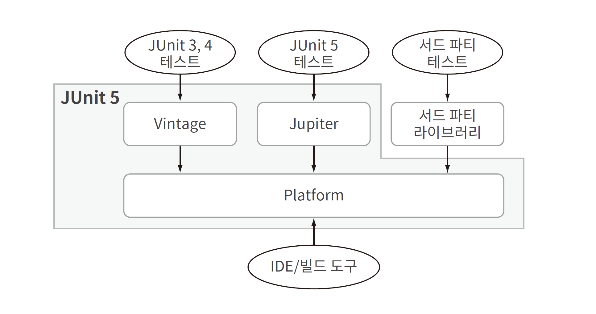
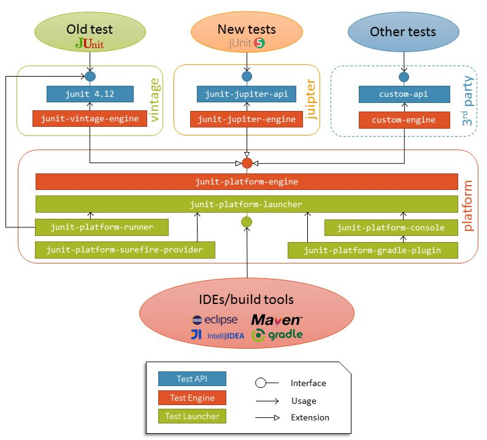

# 3. JUnit 아키텍처

JUnit 4에서 JUnit 5로의 변화는 **모듈화** 이다.

- 특정한 기능이 필요하다면 이를 구현한 모듈을 사용하면 됨.
- 전체 테스트 프레임워크를 불러오는 대신 특정 모듈만 사용한다면 시간과 메모리를 절약.

## JUnit

JUnit 아키텍처는 다음 세 가지 모듈로 나뉜다.

- JUnit Platform: JVM 위에서 테스트 프레임워크를 구동하기 위한 기반이 되는 플랫폼.
  콘솔, IDE, 빌드 도구에서 테스트를 구동할 수 있는 API도 제공.
- JUnit Jupiter: JUnit에서 테스트와 extension을 만들 수 있도록 프로그램이 모델과 확장 모델(extension model)을 결합한 것이다.

### JUnit Platform (실행 인프라)

- junit-platform-commons: JUnit 안에서 사용하기 위한 JUnit 내부 공통 라이브러리다.
- junit-platform-console: JUnit 테스트를 콘솔에서 실행할 수 있도록 하는 모듈.
- junit-platform-console-standalone: 모든 의존성이 포함되어 있는 실행 가능한 jar 파일이다.
  이 아티팩트는 콘솔에서 JUnit Platform을 구동할 수 있는 커맨드라인 자바 애플리케이션 콘솔 런처에서 사용한다.
- junit-platform-engine: 테스트 엔진용 public API.
- junit-platform-launcher: 테스트 계획을 구성하고 실행하기 위한 public API. 일반적으로 IDE나 빌드 도구에서 사용한다.
- junit-platform-suite-api: JUnit Platform에서 테스트 묶음을 구성하기 위한 애노테이션을 제공.

역할은 크게 3가지다.

1. **발견**: 클래스/패키지/태그 등 기준으로 "어떤 테스트가 있는지" 찾기
2. **실행 오케스트레이션**: 어떤 엔진으로 어떤 테스트를 실행하지 조율
3. **리포팅/이벤트**: 테스트 시작/성공/실패 이벤트를 표준 형태로 발행

Platform은 "JUnit Jupiter 문법을 이해"하지 않는다. 대신 아래의 엔진(SPI)를 사용한다.

### JUnit Jupiter

JUnit Jupiter는 애노테이션, 클래스, 메서드를 비롯하여 JUnit 테스트를 작성하기 위한 프로그래밍 모델과
Extension API를 통해 JUnit extension을 작성하기 위한 확장 모델로 이루어져 있다.

JUnit의 하위 프로젝트에서는 TestEngine을 통해 JUnit Platform에서 Jupiter 기반 테스트를 실행한다.

JUnit Jupiter의 확장 모델은 Extension API로만 구성된다.
참고로 Extension 자체는 단순한 마커 인터페이스이다.

- junit-jupiter-api: JUnit 테스트나 extension 작성을 위한 JUnit Jupiter API다.
- junit-jupiter-engine: 런타임에만 사용하는 테스트 엔진 구현체다.
- junit-jupiter-params: JUnit Jupiter에서 파라미터를 사용한 테스트를 지원한다.

---

## 내부 아키텍처 구성도

JUnit Platform은 JUnit 5, 6 테스트와 서드 파티 테스트를 비롯하여 다양한 종류의 테스트를 실행할 수 있게 해준다.

- junit-jupiter-api는 테스트 엔진을 위한 다양한 기능을 제공함. 서드 파티 테스트를 위한 사용자 정의 API가 있다.
- 테스트 엔진은 JUnit Platform의 일부인 junit-platform-engine의 public API를 상속하여 생성한 것이다.
- junit-platform-launcher의 public API는 Gradle과 같은 빌드 도구나 IDE가 JUnit Platform 내부의 테스트를 발견할 수 있도록 도와준다.

> <https://blog.insightbook.co.kr/wp-content/uploads/2024/05/junit_1.png>

> <https://thisiswoo.github.io/development/junit5.html>
