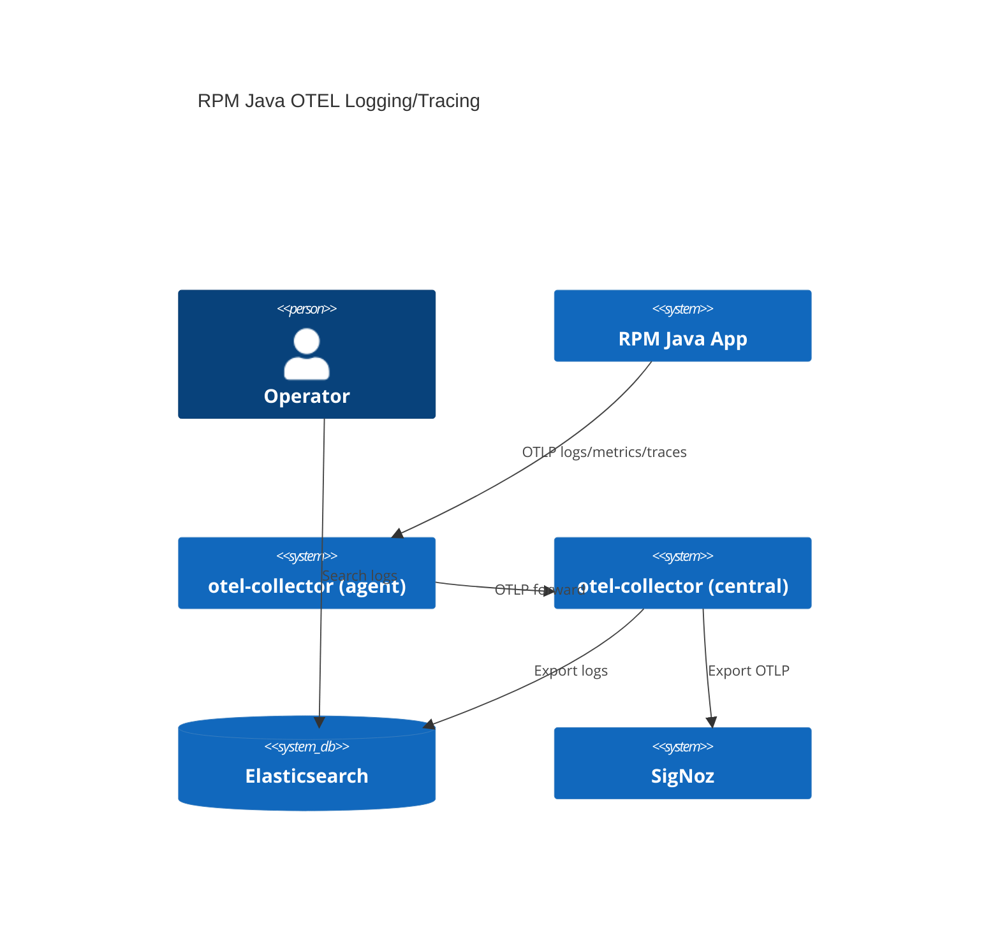

OpenTelemetry 설계(로그/메트릭/트레이싱) 방향을 정리한다.

## AS-IS

- RPM Java 애플리케이션 Logging
- `journald` (stdout, stderr: Pattern Layout Appender)
- `filebeat` (json: ECS Layout Appender) → `Logstash` → ES

## TO-BE

- RPM Java 애플리케이션 Logging + Metrics + Tracing
- 로컬 `otel-collector`가 로그/메트릭/트레이스를 수집해 중앙 `otel-collector`로 전달
- ES, SigNoz로 동시 전송

## 로그 수집 설계

- `stdout/stderr`는 사람 판독용으로 `PatternLayout` 유지
- 구조화 로그는 `ECS JSON` 파일로 별도 기록하고 `otel-collector`가 tailing
- `otel-collector`에서 `filelog` receiver + `transform/attributes` processor로 필드 매핑 후 OTLP 로그로 전송

### 흐름

- `logback` Console Appender → `journald` (로컬 확인용)
- `logback` File Appender(ECS JSON) → `/var/log/<app>/app.json`
- `otel-collector (agent)` → `filelog` receiver → `otlp` exporter → `otel-collector (central)`
- `otel-collector (central)` → `elastic` exporter + `otlp` exporter(SigNoz)

## 메트릭/트레이싱 설계

- `otel-javaagent`가 OTLP로 로컬 `otel-collector`에 전송
- 로컬 `otel-collector`는 공통 리소스 속성을 추가하고 중앙으로 전달

## 결정 사항

- `journald`는 운영자가 읽기 쉬운 `PatternLayout`을 유지한다.
- ES 검색/집계를 위해 구조화 로그는 `ECS JSON` 파일을 유지한다.
- 기존 `filebeat → logstash`는 `otel-collector filelog`로 대체한다.

## filebeat 미사용 시 메타데이터 최소 세트

- 애플리케이션(또는 systemd 서비스 환경변수)에서 고정 값으로 주입
    - `service.name`, `service.version`, `deployment.environment`
- `otel-collector`에서 자동 보강
    - `resourcedetection`으로 `host.*`, `os.*`, `process.*` 추가
- 파일 기반 필드(`log.file.path`)는 파일 미사용 시 비어 있음

## 예시 구성(systemd + log4j2)

### systemd 서비스

```ini
[Unit]
Description=sample-app
After=network.target

[Service]
User=app
WorkingDirectory=/opt/sample-app
Environment="JAVA_OPTS=-Xms512m -Xmx512m"
Environment="OTEL_SERVICE_NAME=sample-app"
Environment="OTEL_RESOURCE_ATTRIBUTES=service.version=1.2.3,deployment.environment=prod"
Environment="OTEL_EXPORTER_OTLP_ENDPOINT=http://127.0.0.1:4317"
Environment="OTEL_LOGS_EXPORTER=otlp"
ExecStart=/usr/bin/java -javaagent:/opt/otel/opentelemetry-javaagent.jar $JAVA_OPTS -jar /opt/sample-app/app.jar
Restart=on-failure

[Install]
WantedBy=multi-user.target
```

### log4j2 설정(PatternLayout + OTLP)

```xml
<?xml version="1.0" encoding="UTF-8"?>
<Configuration status="WARN">
  <Appenders>
    <Console name="Console" target="SYSTEM_OUT">
      <PatternLayout pattern="%d{ISO8601} %-5level [%t] %c{1.} - %m%n"/>
    </Console>
    <OpenTelemetry name="Otel"/>
  </Appenders>
  <Loggers>
    <Root level="info">
      <AppenderRef ref="Console"/>
      <AppenderRef ref="Otel"/>
    </Root>
  </Loggers>
</Configuration>
```

## otel 컴포넌트 예시

### otel-collector (agent)

```yaml
receivers:
    otlp:
        protocols:
            grpc:
            http:

processors:
    resourcedetection:
        detectors: [system, env]
    transform/ecs:
        log_statements:
            - context: log
              statements:
                  - set(attributes["message"], body)
                  - set(attributes["log.level"], severity_text)
                  - set(attributes["trace.id"], trace_id)
                  - set(attributes["span.id"], span_id)

exporters:
    otlp:
        endpoint: otel-collector-central:4317
        tls:
            insecure: true

service:
    pipelines:
        logs:
            receivers: [otlp]
            processors: [resourcedetection, transform/ecs]
            exporters: [otlp]
        traces:
            receivers: [otlp]
            processors: [resourcedetection]
            exporters: [otlp]
        metrics:
            receivers: [otlp]
            processors: [resourcedetection]
            exporters: [otlp]
```

### otel-collector (central)

```yaml
receivers:
    otlp:
        protocols:
            grpc:
            http:

exporters:
    elasticsearch:
        endpoints: ["http://es:9200"]
        logs_index: "otel-logs"
    otlp/signoz:
        endpoint: signoz-otel-collector:4317
        tls:
            insecure: true

service:
    pipelines:
        logs:
            receivers: [otlp]
            exporters: [elasticsearch, otlp/signoz]
        traces:
            receivers: [otlp]
            exporters: [otlp/signoz]
        metrics:
            receivers: [otlp]
            exporters: [otlp/signoz]
```

## 배포 방식

- 각 RPM 호스트에 `otel-collector (agent)`를 systemd 서비스로 배포
- 중앙 `otel-collector`는 별도 VM/컨테이너로 운영
- 애플리케이션은 `otel-javaagent`를 포함해 OTLP로 로컬 agent에 전송

## javaagent 버전 기준

- `otel-javaagent`는 collector와 1:1 버전 고정이 필수는 아님
- OTLP 프로토콜 기준으로 호환되므로 agent/collector는 독립 업그레이드 가능
- 운영 표준은 `otel-javaagent`를 최신 안정 버전으로 고정하고 전 서버 동일 버전 사용
- 애플리케이션이 `opentelemetry-api/sdk`를 직접 사용한다면 동일 메이저(가능하면 동일 마이너)로 맞춘다

## C4 다이어그램



## 미해결 이슈

- 로그 파일 권한/로테이션 정책 (`/var/log/<app>/app.json`)
- `trace_id`, `span_id` 필드 매핑 방식(ECS ↔ OTLP)
