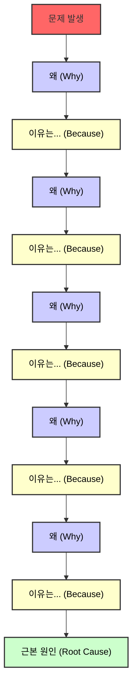

# 장애 대응 절차

1. 장애 전파 (팀내)
2. 담당자 지정
    - 장애 관련한 담당자
3. 장애 처리
    - 장애 이슈를 생성
    - 소통 채널을 생성 (관련 채널에서 스레드를 생성 - 스레드에서만 대화)
    - 가장 빠르게 고객 서비스를 정상적으로 만드는 것을 목표
    - 원인 분석은 그 뒤에
4. 장애 종료
5. 장애 리뷰

## 문화

1. 빨리 문제의 근본 원인을 찾아 해결하는 행위 보다는 정상화되는 것을 목표
2. 당황하지 말자
3. 감정을 조절하고 화를 내지 말자
4. 비난하지 말자

## 필요 사항

- 장애 알림 받기 (Sentry) -> Mattermost

## 장애 공지 템플릿

```text
[ 장애 공지 ] 제목

- 발생 시간:
- 장애 이슈: [!123]()
- 인지 채널
- 증상
- 타임 라인
- 고객 영향
- 장애 원인
- 해결 방법
```

```text
[ 장애 종료 공지 ] 제목

- 발생 시간: yyyy-MM-dd hh:mm:ss ~ yyyy-MM-dd hh:mm:ss
- 장애 이슈: [!123]()
- 인지 채널
- 타임 라인
- 고객 영향
- 장애 원인
- 해결 방법
```

## 장애 후속 조치

- 장애의 원인 분석
- 장애의 재발 방지 대책 마련
- 장애 리뷰

## 장애의 원인 분석

### 5 Why

- 반복적인 Why 질문을 통해 문제의 근본적인 원인을 파해치는 방법
- 주제나 문제에 대해서 깊게 알 수 있도록 질문한다.
- 문제 자체를 파악하기에 좋다.
- 솔루션을 도출하기 좋다.



[문제 발생] 메인 배너가 홈에 노출되지 않았다.

- Q1: 왜 메인 배너가 홈에 노출되지 않았나?
  - A1- Frontend 시스템에서 노출할 배너를 조회했지만 조회되지 않아 배너가 노출되지 않았다.
- Q2: 왜 Frontend 시스템에서 노출할 배너를 조회했지만 조회되지 않았나?
  - A2 - 노출할 배너를 담당자가 등록을 해야하는데 등록하지 않았다.
- Q3: 왜 담당자는 배너를 등록하지 않았나?
  - A3 - 담당자가 배너 등록해야 하는 것을 인지하지 못했다.
- Q4:- 담당자는 왜 배너 등록해야 하는 것을 인지하지 못했나?
  - A4 - 담당자는 배너 등록 관리를 수동으로 하다보니 등록 여부를 확인하지 못했다.
- Q5: 왜 담당자는 배너 등록 관리를 수동으로 했나?
  - A5 - 배너의 관리 도구가 없어서 수동으로 직접 등록 여부를 확인하고 있다.

> 관리 도구 부재. 배너 노출 검사 부재

## 장애 재발 방지

- 포카요케

### 포카요케

- 여러가지 행동 제약이나 강제하는 방법
- 실수를 원천적으로 발생하지 않게 하는 것
- 예: 정해진 절차를 따랐는지
